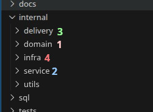
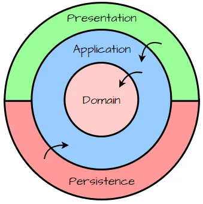
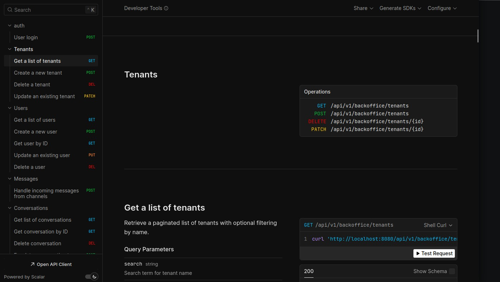

# Ivosights Sociomile (Test Project)

## Installation

1. Install **Taskfile** runner. (See: [https://taskfile.dev/docs/installation](https://taskfile.dev/docs/installation))
2. Install **goose**. (See: [https://github.com/pressly/goose](https://github.com/pressly/goose?tab=readme-ov-file#install))
3. Karena project ini bersifat temporer dan berjalan di local, saya sengaja mengikutsertakan file `.env` untuk mempermudah konfigurasi.
4. Jalankan default task di Taskfile.yml (dengan command `task`/`go-task`), tunggu hingga selesai.
5. Jika app container sudah running, dokumentasi API dapat diakses di [http://localhost:8080/docs](http://localhost:8080/docs) (untuk port terdapat pada environment variable `HTTP_PORT` di `.env.docker`)
6. User admin sudah dibuat secara otomatis dengan email `admin@mail.com` dan password `my_secure_password` (dapat dilihat di sql/migrations).

## Testing
Jalankan command `task test` untuk menjalankan pengujian.

Pengujian unit (Unit Test) terdapat pada file-file yang berakhiran `_test.go` di dalam folder `internal`.

Pengujian fitur-fitur utama (Integration Test), terdapat pada file `tests/full_cycle_test.go`. Pengujian ini akan melakukan simulasi API request ke aplikasi.

## Architecture
Di project ini saya menggunakan Clean Architecture sehingga project dapat dengan mudah untuk dimengerti, dipelihara, diuji, dan dikembangkan.

Dengan menggunakan Clean Architecture, kita dapat memisahkan kode berdasarkan tanggung jawabnya. Contohnya saya menggunakan interface untuk mendefinisikan kontrak repository di dalam service, dan implementasinya berada di layer `infra`. Dengan begitu, jika suatu saat ingin mengganti implementasi repository (misalnya dari database MySQL ke PostgreSQL, atau distributed database), kita hanya perlu membuat implementasi baru tanpa harus mengubah kode di service/usecase.

### Message Bus
Untuk asynchronous processing, saya menggunakan RabbitMQ sebagai message broker. Proses tersebut diimplementasikan di message service saat webhook menerima message dari channel eksternal, kemudian message tersebut akan diproses secara asynchronous oleh worker yang subscribe ke queue RabbitMQ.

## Multi-Tenancy
Project ini juga sudah mendukung multi-tenancy dengan menggunakan pendekatan shared database, dimana semua tenant menggunakan database yang sama yang dipisahkan berdasarkan `tenant_id`.

Sebenarnya ada beberapa pendekatan lain seperti `shared schema`, dan `dedicated database`, namun saat ini saya memilih shared database karena lebih sederhana dan waktu yang terbatas.

Saya ingin menambahkan fitur multi-tenancy dengan pendekatan `dedicated database` yang memisahkan tenant per _.parquet_ file menggunakan **MinIO** + **Iceberg** + **Trino** + **Airflow**, namun karena keterbatasan waktu dan kompleksitasnya, saya memutuskan untuk fokus pada pendekatan shared database saja.

## API Documentation
Dokumentasi API dibuat menggunakan **Swagger** dengan bantuan library `swaggo/swag`, dan ditampilkan menggunakan **Scalar**. Dokumentasi API dapat diakses di [http://localhost:8080/docs](http://localhost:8080/docs).

## Database Migration
Database migration menggunakan tool `goose`. File-file migrasi terdapat pada folder `db/migrations`. Untuk menjalankan migrasi, gunakan command `goose up`(migrasi sudah berjalan otomatis dengan menjalankan Taskfile -> Installation poin 4).

## Asumsi dan trade-off
1. Saya mengasumsikan bahwa setiap tenant memiliki struktur data yang sama, sehingga saya menggunakan pendekatan shared database untuk multi-tenancy.
2. Karena saya kurang memahami kebutuhan spesifik untuk agent assignment pada suatu conversation yang baru/open, saya mengasumsikan semua agent memiliki kapasitas yang sama, sehingga untuk menentukan agent yang di-assign saya hanya memilih secara acak.
3. Saya memilih Clean Architecture karena memberikan struktur yang jelas dan memisahkan tanggung jawab dengan baik, meskipun mungkin membutuhkan lebih banyak boilerplate code dibandingkan dengan arsitektur yang lebih sederhana.
4. Saya menggunakan pendekatan shared database untuk multi-tenancy karena lebih sederhana dan waktu yang terbatas, walaupun rentan terhadap masalah keamanan dan isolasi data antar tenant dibandingkan dengan pendekatan dedicated database.

## License
MIT License. See [LICENSE](LICENSE) for more details.